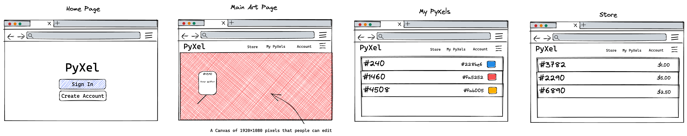

# PyXel

PyXel is a collaborative art project where individual pixels of a 1920 x 1080 canvas are sold and can be customized to any of the thousands of RGB colors. Users can collaborate with each other offline to come together to create a masterpiece. Purchase more pixels next to each other to create more complex pieces of art!

## Key Features

* Asynchronous Editing and Live Update
* Organization of PyXels
* Account Editing with authentication

## Key Technologies
 * Authentication: Individual accounts that your PyXels are linked to
 * Database Data: Records accounts and state of PyXels
 * Websocket: Refreshing of the home page representing a live state of the canvas

## Basic Mockup

	

## HTML Deliverable

For this deliverable I modified the following:

* Added html pages in the `/src` directory for the home page, myPyXels, sign in , and store
* Included placeholders on the home page for the live websocket data showing the status of the canvas
* Add placeholders on store and my PyXels page representing data fetched from database
* Add Sign in component form that links to the home page
* Add nav links on each page that link to each other

## CSS Deliverable
* Add Navbar CSS on each page
* Add responsive elements to each page
* Add Footer to each page
* Edit text styles and colors for application
* Application looks mostly like prototype

## Javascript Deliverable
* Added local array that is placeholder data for all the pyxels
* Added login info to localstorage
* Added event handlers for all UI elements and app now behaves properly
* Add placeholder for the homepage which will hold the websocket with sample data

## Startup Service Deliverable
* Integrated node webserver into application
* Moved mock db data onto server and created CRUD endpoints for it
* Altered frontend to call backend service
* Added third-party quote caption on the home page
* Modulized DB functions

## DB Deliverable
* Added use of MongoDB into the project
* All service endpoints now connect to DB and use live data
* Client code store and myPyxels use DB endpoints
* Updated main screen to also use DB endpoints instead of mock data